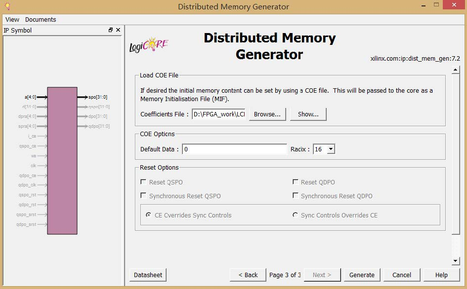

# MIPS CPU with Limited Interrupt Support

# 不完全支持中断的流水线 MIPS 处理器

计算机组成原理实验之一
可以在浙江大学 Sword 开发平台上下载运行。编译需要用到 Xilinx ISE Design，建立新的工程，并将代码一一导入，建立层次结构。并生成名为 ROM_D 和 RAM_B 的 IP 核。建立工程和建立 IP 核参数如下图：

初始化文件为 D_mem.coe

初始化文件为SOC_SCPU_INT.coe

本处理器支持 MIPS 指令中的 46 条指令，为流水线处理器,支持数据相关和控制相关，支持处理器外部中断、系统调用、溢出异常和未实现指令异常。但协处理器与寄存器组之间的数据相关需要在指令中加入 nop 以防止异常。

实验效果需要自己憧憬项目或者将项目中的 top.bit 文件下入开发板中查看。

## 已实现指令：
	MIPS-C2＝{LB、LBU、LH、LHU、LW、SB、SH、SW、ADD、ADDU、SUB、SUBU、SLL、SRL、SRA、SLLV、SRLV、SRAV、AND、OR、XOR、NOR、SLT、SLTU、ADDI、ADDIU、ANDI、ORI、XORI、LUI、SLTI、SLTIU、BEQ、BNE、BLEZ、BGTZ、BLTZ、BGEZ、J、JAL、JALR、JR}
### 与中断和异常有关的指令
    mtc0 mfc0 eret syscall
